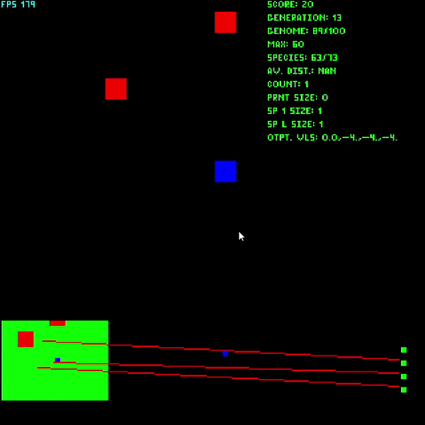
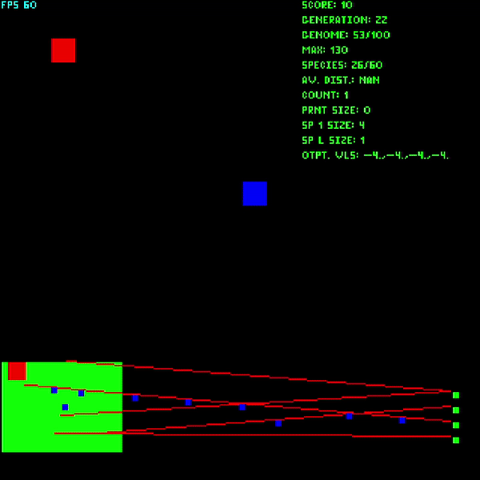

# Java-N.E.A.T
A Java implementation of the N.E.A.T algorithm

Example of different Nueral Networks being tested and assigned a fitness score, a key part in training networks with evolution.

Example of network trained to avoid red squares.

